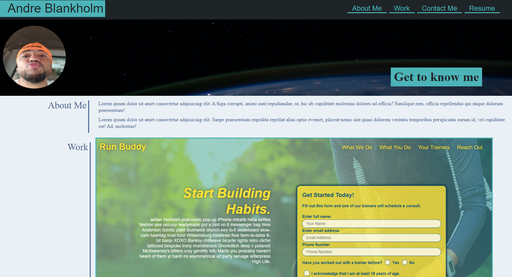

# good-choice-portfolio

# Languages used: HTML and CSS

## AS AN potential new hire: I want employers to see a deployed portfolio of work samples so that they can review samples of my work and assess whether i'm a good candidate for an open position

### Acceptance Criteria : Employers need to sample a potential employee's previous work
WHEN you load their portfolio:

THEN you are presented with the developer's name, a recent photo or avatar, and links to sections about them, their work, and how to contact them.

WHEN you click one of the links in the navigation
THEN the UI scrolls to the corresponding section.

WHEN you click on the link to the section about their work
THEN the UI scrolls to a section with titled images of the developer's applications.

WHEN your am presented with the developer's first application
THEN that application's image should be larger in size than the others.

WHEN you click on the images of the applications
THEN you are taken to that deployed application.

WHEN you resize the page or view the site on various screens and devices
THEN you are presented with a responsive layout that adapts to my viewport.

## Links to project: <a href="https://github.com/AndreBlankholm/good-choice-portfolio">GitHub Web Page</a> and <a href="https://andreblankholm.github.io/good-choice-portfolio/">Live Public URL</a>

##
 License & copyright
© Andre Blankholm, U of M Coding Bootcamp